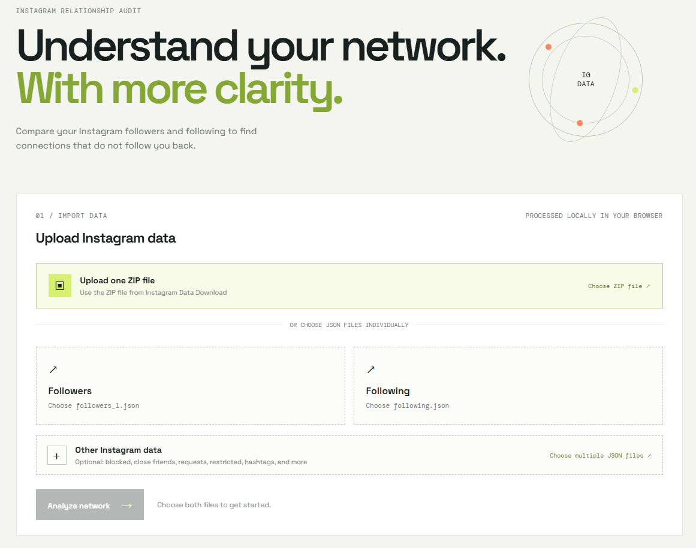

# Orbit Instagram Check

> A private, client-side dashboard for understanding your Instagram connections.

[Open the live dashboard](https://orbit-check.vercel.app/)



Orbit Instagram Check compares your Instagram followers and following data, then highlights accounts that do not follow you back. It runs entirely in the browser: no Instagram password, login, scraping, or backend upload is required.

## Features

- Import one Instagram Data Download ZIP file.
- Import `followers_*.json` and `following.json` manually.
- Support multiple followers files such as `followers_1.json` and `followers_2.json`.
- Read additional Instagram exports, including blocked profiles, close friends, following hashtags, hidden story accounts, pending requests, recent requests, recently unfollowed profiles, removed suggestions, and restricted profiles.
- Show followers, following, mutual connections, and accounts that do not follow back.
- Search usernames and sort results alphabetically.
- Open an account directly from the results list.
- View counts and lists for additional Instagram data categories.
- Reset the current analysis at any time.

## Privacy First

- Your files are parsed locally in your browser.
- No Instagram password or account login is requested.
- The dashboard does not scrape Instagram.
- Your selected files are not uploaded to an application server.
- Refreshing the page clears the current analysis.

## Requirements

- A current version of Chrome, Edge, Firefox, or Safari.
- An official Instagram Data Download ZIP or JSON export.
- An internet connection on the first visit so the ZIP parsing library can load from jsDelivr.

## Get Your Instagram Data

1. Open Instagram and sign in to your account.
2. Open **Settings and activity**.
3. Go to **Accounts Center**.
4. Select **Your information and permissions**.
5. Select **Download your information**.
6. Choose the Instagram account to export.
7. Select **Some of your information**, if available.
8. Select **Followers and following** and any additional categories you want to inspect.
9. Choose **JSON** as the format.
10. Request the download and wait for Instagram to prepare it.
11. Download the ZIP file to your device.

Instagram may change the names of these menus. Always use Instagram's official data download feature and never enter your password into this dashboard.

## Use the Dashboard

### Option 1: Upload the ZIP

1. Open the [live dashboard](https://orbit-check.vercel.app/).
2. Select **Upload one ZIP file**.
3. Choose the ZIP downloaded from Instagram.
4. Wait until the file is read successfully.
5. Select **Analyze network**.

The dashboard searches the ZIP, including its subfolders, for followers, following, and supported additional data files.

### Option 2: Upload JSON files

1. Select one or more `followers_*.json` files in **Followers**.
2. Select `following.json` in **Following**.
3. Optionally select additional Instagram JSON files in **Other Instagram data**.
4. Select **Analyze network**.

Use **Reset analysis** to clear the current result. Refreshing the page also starts a new empty session.

## Use Without Downloading

The easiest way to use the project is through the public Vercel deployment:

**[https://orbit-check.vercel.app/](https://orbit-check.vercel.app/)**

Open the link, select your own Instagram ZIP or JSON files, and start the analysis. Each user selects and processes their own data locally in their browser.

## Download the Project from GitHub

Downloading the source code is optional. If you want a local copy:

1. Open the [GitHub repository](https://github.com/mldtmakbar/orbit-check).
2. Select **Code**.
3. Select **Download ZIP**.
4. Extract the downloaded archive.
5. Open `index.html` in a browser.

No database, backend, or package installation is required for the static version.

## Technology

- HTML, CSS, and vanilla JavaScript.
- JSZip for reading Instagram ZIP files in the browser.
- Vercel static deployment.

React is not required for this project because the dashboard is a client-side static application.

## Image in This README

The preview above uses `image.png` from the repository root. To add or replace the preview image:

1. Add your image file to the repository, for example `image.png`.
2. Reference it with complete Markdown syntax:

	```markdown
	
	```

3. Commit and push the image together with `README.md`.

The image filename and path are case-sensitive on GitHub. A line containing only `!` will not display an image.